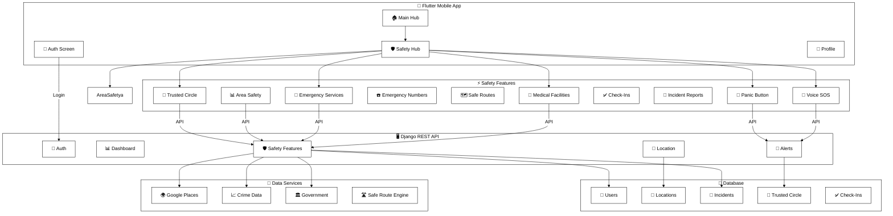

# Tourist Safety App - System Architecture

```mermaid
%%{init: {'theme': 'base', 'themeVariables': { 'primaryColor':'#ffffff', 'primaryTextColor':'#000000', 'primaryBorderColor':'#000000', 'lineColor':'#000000', 'secondBkgColor':'#f9f9f9', 'tertiaryColor':'#ffffff', 'tertiaryTextColor':'#000000', 'tertiaryBorderColor':'#000000'}}}%%
graph TB
    subgraph Mobile["📱 Flutter Mobile App"]
        Auth["🔐 Auth Screen"]
        MainHub["🏠 Main Hub"]
        SafetyHub["🛡️ Safety Hub"]
        Profile["👤 Profile"]
    end

    subgraph SafetyFeatures["⚡ Safety Features"]
        MedicalFacilities["🏥 Medical Facilities"]
        EmergencyServices["🚨 Emergency Services"]
        AreaSafety["📊 Area Safety"]
        EmergencyNumbers["☎️ Emergency Numbers"]
        SafeRoutes["🗺️ Safe Routes"]
        TrustedCircle["👥 Trusted Circle"]
        CheckIns["✅ Check-Ins"]
        IncidentReports["📢 Incident Reports"]
        VoiceSOS["🎤 Voice SOS"]
        PanicSOS["🚨 Panic Button"]
    end

    subgraph Backend["🖥️ Django REST API"]
        AuthAPI["📝 Auth"]
        DashboardAPI["📊 Dashboard"]
        LocationAPI["📍 Location"]
        AlertsAPI["🚨 Alerts"]
        SafetyAPI["🛡️ Safety Features"]
    end

    subgraph DataServices["🔗 Data Services"]
        GooglePlaces["🌍 Google Places"]
        CrimeData["📈 Crime Data"]
        GovEmergency["🏛️ Government"]
        SafeRouteService["🛣️ Safe Route Engine"]
    end

    subgraph Database["💾 Database"]
        UserDB["👤 Users"]
        LocationDB["📍 Locations"]
        IncidentDB["📢 Incidents"]
        TrustedDB["👥 Trusted Circle"]
        CheckInDB["✅ Check-Ins"]
    end

    Auth -->|Login| AuthAPI
    MainHub --> SafetyHub
    SafetyHub --> MedicalFacilities
    SafetyHub --> EmergencyServices
    SafetyHub --> AreaSafetya
    SafetyHub --> TrustedCircle
    SafetyHub --> VoiceSOS
    SafetyHub --> PanicSOS

    MedicalFacilities -->|API| SafetyAPI
    EmergencyServices -->|API| SafetyAPI
    AreaSafety -->|API| SafetyAPI
    TrustedCircle -->|API| SafetyAPI
    VoiceSOS -->|API| AlertsAPI
    PanicSOS -->|API| AlertsAPI

    SafetyAPI --> GooglePlaces
    SafetyAPI --> CrimeData
    SafetyAPI --> GovEmergency

    SafetyAPI --> UserDB
    LocationAPI --> LocationDB
    SafetyAPI --> IncidentDB
    AlertsAPI --> TrustedDB
```
