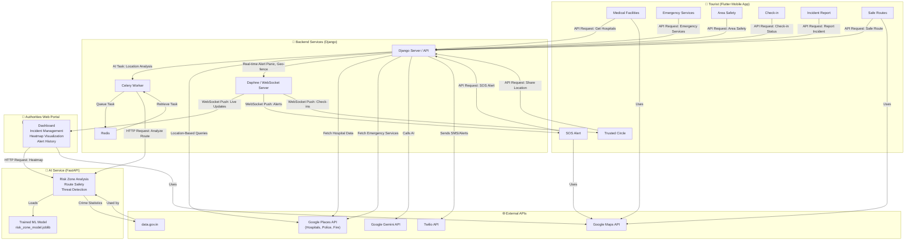

# Feature Flows & System Architecture

## Complete System Architecture

```mermaid
graph TD
    subgraph Tourist["👤 Tourist (Flutter Mobile App)"]
        A1[Medical Facilities]
        A2[Emergency Services]
        A3[Area Safety]
        A4[SOS Alert]
        A5[Trusted Circle]
        A6[Check-in]
        A7[Incident Report]
        A8[Safe Routes]
    end

    subgraph Backend["🔧 Backend Services (Django)"]
        B["Django Server / API"]
        C["Celery Worker"]
        D["Redis"]
        E["Daphne / WebSocket Server"]
    end

    subgraph AI["🤖 AI Service (FastAPI)"]
        F["Risk Zone Analysis<br/>Route Safety<br/>Threat Detection"]
        G["Trained ML Model<br/>risk_zone_model.joblib"]
    end

    subgraph Authorities["👮 Authorities Web Portal<br/>(Django Template)"]
        H["Dashboard<br/>Incident Management<br/>Heatmap Visualization<br/>Alert History"]
    end

    subgraph External["🌐 External APIs"]
        I["Google Maps API"]
        J["Google Gemini API"]
        K["Twilio API"]
        L["data.gov.in"]
        GP["Google Places API<br/>(Hospitals, Police, Fire)"]
    end

    A1 -->|API Request: Get Hospitals| B
    A2 -->|API Request: Emergency Services| B
    A3 -->|API Request: Area Safety| B
    A4 -->|API Request: SOS Alert| B
    A5 -->|API Request: Share Location| B
    A6 -->|API Request: Check-in Status| B
    A7 -->|API Request: Report Incident| B
    A8 -->|API Request: Safe Route| B
    
    B -->|AI Task: Location Analysis| C
    B -->|Location-Based Queries| GP
    B -->|Real-time Alert Panic, Geo-fence| E
    
    C -->|Queue Task| D
    D -->|Retrieve Task| C
    C -->|HTTP Request: Analyze Route| F
    
    F -->|Loads| G
    
    E -->|WebSocket Push: Live Updates| H
    E -->|WebSocket Push: Alerts| A4
    E -->|WebSocket Push: Check-ins| A5
    
    H -->|HTTP Request: Heatmap| F
    
    A1 -->|Uses| I
    A4 -->|Uses| I
    H -->|Uses| I
    A8 -->|Uses| I
    
    B -->|Fetch Hospital Data| GP
    B -->|Fetch Emergency Services| GP
    B -->|Calls AI| J
    B -->|Sends SMS/Alerts| K
    
    F -->|Crime Statistics| L
    L -->|Used by| F
```

---

## Feature Flows

```mermaid
%%{init: {'theme': 'base', 'themeVariables': { 'primaryColor':'#ffffff', 'primaryTextColor':'#000000', 'primaryBorderColor':'#000000', 'lineColor':'#000000', 'secondBkgColor':'#f9f9f9', 'tertiaryColor':'#ffffff', 'tertiaryTextColor':'#000000', 'tertiaryBorderColor':'#000000'}}}%%
graph TB
    subgraph SOSFlow["🚨 SOS Alert Flow"]
        User["👤 Tourist"]
        SOS1["Panic Button"]
        GetLoc["Get GPS Location"]
        SendAlert["Send SOS Alert"]
        Notify["Notify Circle"]
        Police["Alert Police"]
        Email["Email"]
        SMS["SMS"]
        WS["WebSocket Push"]
        Authority["Authorities Portal"]
    end

    subgraph MedicalFlow["🏥 Medical Facilities"]
        User2["👤 Tourist"]
        OpenMedical["Open Medical Screen"]
        GetLoc2["Get Location"]
        CallAPI["Call Backend API"]
        GoogleAPI["Google Places API"]
        RealData["Real Hospitals Data"]
        DisplayData["Display on Map"]
        Navigate["Navigate"]
    end

    subgraph EmergencyFlow["🚨 Emergency Services"]
        User4["👤 Tourist"]
        OpenEmerg["Open Emergency Screen"]
        GetLoc4["Get Location"]
        CallAPI2["Call Backend API"]
        GoogleAPI2["Google Places API"]
        Types["Police | Fire | Ambulance"]
        DisplayEmerg["Distance Sorted List"]
        NavigateEmerg["Navigate to Service"]
    end

    subgraph SafetyFlow["📊 Area Safety"]
        User3["👤 Tourist"]
        OpenSafety["Open Safety Screen"]
        GetLoc3["Get Location"]
        QueryCrime["Query Crime Data"]
        GetReports["Get Incident Reports"]
        Calculate["Calculate Score"]
        DisplaySafety["Display Rating"]
        ColorCode["Color: Red/Orange/Green"]
    end

    subgraph TrustedCircleFlow["👥 Trusted Circle"]
        User5["👤 Tourist"]
        AddCircle["Add Family Members"]
        ShareLoc["Share Live Location"]
        CircleNotify["Send Notifications"]
        CircleRecv["Family Receives Alert"]
    end

    subgraph CheckInFlow["✅ Check-In Status"]
        User6["👤 Tourist"]
        CheckIn["Create Check-In"]
        LocStatus["Location + Status"]
        IncidentNote["Optional Note/Incident"]
        CircleUpdate["Notify Trusted Circle"]
    end

    subgraph SafeRouteFlow["🗺️ Safe Routes"]
        User7["👤 Tourist"]
        SetRoute["Set Start & End"]
        CallAI["Call AI Service"]
        AnalyzeZones["Analyze Crime Zones"]
        AvoidHotspots["Suggest Safe Paths"]
        NavigateSafe["Navigate Safely"]
    end

    subgraph IncidentFlow["🆘 Incident Report"]
        User8["👤 Tourist"]
        ReportInc["Report Incident"]
        IncDetails["Location + Type + Photo"]
        BackendStore["Backend Storage"]
        GovDB["Government Database"]
        AuthoritiesView["Authorities See Report"]
    end

    User --> SOS1
    SOS1 --> GetLoc
    GetLoc --> SendAlert
    SendAlert --> Notify
    SendAlert --> Police
    Notify --> Email
    Notify --> SMS
    SendAlert --> WS
    WS --> Authority

    User2 --> OpenMedical
    OpenMedical --> GetLoc2
    GetLoc2 --> CallAPI
    CallAPI --> GoogleAPI
    GoogleAPI --> RealData
    RealData --> DisplayData
    DisplayData --> Navigate

    User4 --> OpenEmerg
    OpenEmerg --> GetLoc4
    GetLoc4 --> CallAPI2
    CallAPI2 --> GoogleAPI2
    GoogleAPI2 --> Types
    Types --> DisplayEmerg
    DisplayEmerg --> NavigateEmerg

    User3 --> OpenSafety
    OpenSafety --> GetLoc3
    GetLoc3 --> QueryCrime
    QueryCrime --> GetReports
    GetReports --> Calculate
    Calculate --> DisplaySafety
    DisplaySafety --> ColorCode

    User5 --> AddCircle
    AddCircle --> ShareLoc
    ShareLoc --> CircleNotify
    CircleNotify --> CircleRecv

    User6 --> CheckIn
    CheckIn --> LocStatus
    LocStatus --> IncidentNote
    IncidentNote --> CircleUpdate

    User7 --> SetRoute
    SetRoute --> CallAI
    CallAI --> AnalyzeZones
    AnalyzeZones --> AvoidHotspots
    AvoidHotspots --> NavigateSafe

    User8 --> ReportInc
    ReportInc --> IncDetails
    IncDetails --> BackendStore
    BackendStore --> GovDB
    GovDB --> AuthoritiesView
```
