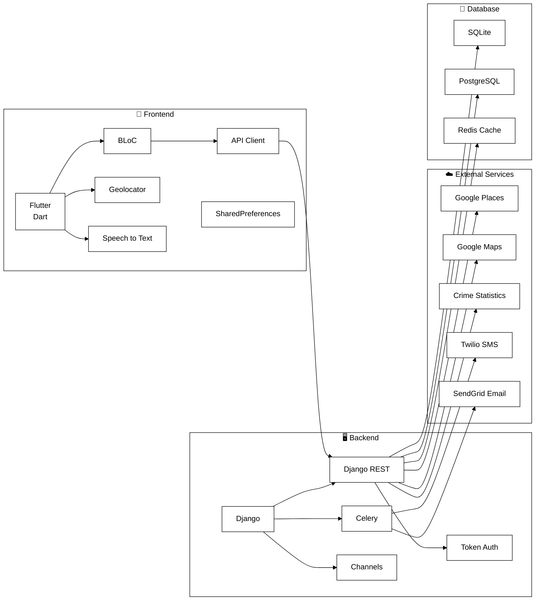

# Technology Stack

```mermaid
%%{init: {'theme': 'base', 'themeVariables': { 'primaryColor':'#ffffff', 'primaryTextColor':'#000000', 'primaryBorderColor':'#000000', 'lineColor':'#000000', 'secondBkgColor':'#f9f9f9', 'tertiaryColor':'#ffffff', 'tertiaryTextColor':'#000000', 'tertiaryBorderColor':'#000000'}}}%%
graph LR
    subgraph Frontend["📱 Frontend"]
        Flutter["Flutter<br/>Dart"]
        BLoC["BLoC"]
        APIClient["API Client"]
        GeoLoc["Geolocator"]
        Speech["Speech to Text"]
        LocalStorage["SharedPreferences"]
    end

    subgraph Backend["🖥️ Backend"]
        Django["Django"]
        DRF["Django REST"]
        Celery["Celery"]
        WebSocket["Channels"]
        Auth["Token Auth"]
    end

    subgraph Services["☁️ External Services"]
        GooglePlaces["Google Places"]
        GoogleMaps["Google Maps"]
        CrimeData["Crime Statistics"]
        TwilioSMS["Twilio SMS"]
        SendGrid["SendGrid Email"]
    end

    subgraph Database["💾 Database"]
        SQLite["SQLite"]
        PostgreSQL["PostgreSQL"]
        Redis["Redis Cache"]
    end

    Flutter --> BLoC
    BLoC --> APIClient
    Flutter --> GeoLoc
    Flutter --> Speech

    APIClient --> DRF

    Django --> DRF
    Django --> Celery
    Django --> WebSocket
    DRF --> Auth

    DRF --> GooglePlaces
    DRF --> GoogleMaps
    DRF --> CrimeData
    Celery --> TwilioSMS
    Celery --> SendGrid

    DRF --> SQLite
    DRF --> PostgreSQL
    DRF --> Redis
```
