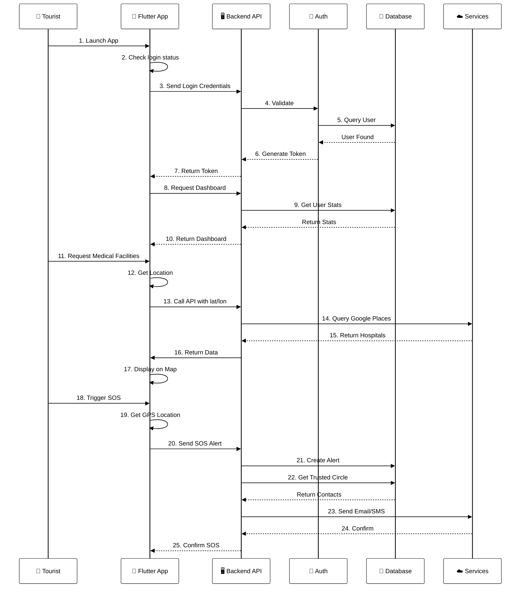

# User Flow & Session Management

```mermaid
%%{init: {'theme': 'base', 'themeVariables': { 'primaryColor':'#ffffff', 'primaryTextColor':'#000000', 'primaryBorderColor':'#000000', 'lineColor':'#000000', 'secondBkgColor':'#f9f9f9', 'tertiaryColor':'#ffffff', 'tertiaryTextColor':'#000000', 'tertiaryBorderColor':'#000000'}}}%%
sequenceDiagram
    participant User as 👤 Tourist
    participant Mobile as 📱 Flutter App
    participant API as 🖥️ Backend API
    participant Auth as 🔐 Auth
    participant Database as 💾 Database
    participant External as ☁️ Services

    User->>Mobile: 1. Launch App
    Mobile->>Mobile: 2. Check login status
    Mobile->>API: 3. Send Login Credentials
    API->>Auth: 4. Validate
    Auth->>Database: 5. Query User
    Database-->>Auth: User Found
    Auth-->>API: 6. Generate Token
    API-->>Mobile: 7. Return Token
    Mobile->>API: 8. Request Dashboard
    API->>Database: 9. Get User Stats
    Database-->>API: Return Stats
    API-->>Mobile: 10. Return Dashboard

    User->>Mobile: 11. Request Medical Facilities
    Mobile->>Mobile: 12. Get Location
    Mobile->>API: 13. Call API with lat/lon
    API->>External: 14. Query Google Places
    External-->>API: 15. Return Hospitals
    API->>Mobile: 16. Return Data
    Mobile->>Mobile: 17. Display on Map

    User->>Mobile: 18. Trigger SOS
    Mobile->>Mobile: 19. Get GPS Location
    Mobile->>API: 20. Send SOS Alert
    API->>Database: 21. Create Alert
    API->>Database: 22. Get Trusted Circle
    Database-->>API: Return Contacts
    API->>External: 23. Send Email/SMS
    External-->>API: 24. Confirm
    API-->>Mobile: 25. Confirm SOS
```
